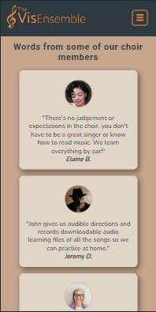

# The VisEnsemble

Welcome to The VisEnsemble Choir website! This is a mock-up website for a real choir for visually impaired people in Dublin called 'The Visionaries Choir'.  This website hopes to help people become more aware of what the choir is about and who are its members, motivate other visually impaired people to become members and to increase opportunities for public performances.


[Visit The VisEnsemble Live Website here](https://monipar.github.io/the-visensemble/)

___

# Table of Contents

1. [Overview](#overview)
2. [Features](#features)  
    * [A Skip Navigation Link](#a-skip-navigation-link)
    * [The Header](#the-header)
    * [The Landing Page](#the-landing-page)
    * [A Back to Top Link](#a-back-to-top-link)
    * [The Footer](#the-footer)
    * [The About Page](#the-about-page)
    * [The Events Page](#the-events-page)
    * [The Contact Form Page](#the-contact-form-page)
    * [Future Features](#future-features)
3. [User Experience (UX)](#user-experience-ux)
    * [Strategy / Site Goals](#strategysite-goals)
    * [Scope / User Stories](#scopeuser-stories)
    * [Structure / Design Choices](#structuredesign-choices)
    * [Skeleton / Wireframes](#skeletonwireframes)
    * [Surface](#surface)
4. [Technologies](#technologies)
5. [Testing](#testing)
    * [Validator Testing](#validator-testing)
    * [Lighthouse Testing](#lighthouse-testing)
    * [Manual Testing](#manual-testing)
6. [Bugs](#bugs)
7. [Citation of Sources](#citation-of-sources)
    * [Content](#content)
    * [Media](#media)
8. [Acknowledgements](#acknowledgements)

---

# Overview

The aim of this project is to demonstrate skills in HTML and CSS.  Some JavaScript is used for interactivity and to make the website better accessible with screen-readers.

It is a mobile-first built and is responsive on tablet, desktop and screens up to 2000px wide. It is also compatible with all popular browsers. 

The website is intended to target the visually impaired community including friends, families and organisations for the blind/visually impaired/disabled as well as event organisers, State bodies, art Councils and the general public. 

They will be able to see the schedule of events, rehearsal times and locations as well as a way to learn about and contact the choir in order to join, seek further information or book them for an event. 

---

# Features

## A Skip Navigation Link

  Featured on all four pages, the skip navigation link comes into view when it gets keyboard focus.  This allows the returning user to skip the logo and navigation links and go straight to the main content of the page.

  


## The Header

  Featured on all four pages, the fully responsive header includes:

1. A link to the Logo which brings the user to the home page.
2. A hamburger button on mobile which opens up a navigation list with links to the Home, About, Events and Contact pages. This helps reduce the clutter on the header by keeping the page links neatly stowed away until the user navigates to the hamburger button. The links have a hover and focus effect to help the user identify them as links. 
3. Links to the Home, About, Events and Contact pages on tablet and desktop which help the user to easily navigate from page to page without having to revert back to the previous page via the back button. The link to the current page is also underlined to help the user identify the page they are on. 

### Mobile Screenshot


### Tablet / Desktop Screenshot


## The Landing Page

  The home page hero on the landing page includes a photograph of the choir with a text overlay which captures the essence of the choir.  This section introduces the sighted user to the choir with an eye catching image to grab their attention, the text gives the non-sighted user a very brief introduction to the choir.

### Mobile Screenshot
    iPhone 6/7/8 


### Desktop Screenshot
    Laptop width 1024px 


## Home Page Content

1. An inspiring quote by Helen Keller which introduces the ethos of the choir presented in a blockquote format with a picture of Helen Keller on the left. This is meant to motivate the user to read on about the vision of the choir.
2. The Vision Section allows the user to see the benefits of joining the choir, as well as the benefits of singing overall. It is presented with icons which help the sighted user to distinguish between the different statements presented.  Screen readers will ignore these icons completely and move on to the text instead. This should encourage the user to consider joining the choir to help improve their quality of life. 
3. The Call to Action (CTA) card includes a background image with a thick orange border to draw the eye. The text overlay expresses the call for new members and directs the eye to the bright orange button at the bottom which links to the contact page. The button has a hover and focus effect to make the user aware that it will lead to somewhere. This is meant to give the user a quick and easy way to get to the sign up page at the end.  It is placed on the Home page to encourage more users to get in touch. 

### Mobile Screenshots
    Galaxy S9


    iPhone 12 Pro


### Tablet Screenshot
    Surface Pro 7


## A Back to Top Link
  
  Featured on all four pages, the back to top button is placed right before the footer for easy navigation. It is linked with the skip navigation link to bring the sighted user to the top of the page and gives the keyboard navigation user the option to either skip to main content or go through the navigation list in the header.  It also has a hover and focus effect to help the user identify it as an interactive asset.  


## The Footer

  Featured on all four pages, includes icons which when clicked or focussed on will bring up a phone number and email address for easy contact with the choir master.  Screen readers are able to read out the phone numbers and the email address as well.  The social icons are labelled links which will open in a new tab to allow for easy navigation for the user.  The footer is valuable to the user as it encourages them to get in touch via phone or email if they prefer that method of contact and it also allows the user to keep connected via social media. (Refer to image above)


## The About Page

1. The About page opens with an about us section which is overlayed on a background image.  It displays a paragraph on the history of the choir and a read more button which when clicked brings up the rest of the choir history. The read more button was added to reduce the amount of text visible on the page, it is up to the user if they want to find out more about the history of the choir or move on to the next section. The feature has a read less button as well which will hide the second chunck of text once read. 
2. The flip card with a snippet of the Conductor's Biography is an eye catching feature which displays a photo of the conductor with a background of piano keys and information about his qualifications and conducting experience.  This is helpful for the user as it gives more information about the Conductor as well as links to his social media for more information or to connect. 
3. The Rehearsal card is a useful feature on which the rehearsal day and time, location and cost are displayed.  The icons are accessible by screen readers and have a little tooltip explaining what they are.  It also has a link to google maps to aid with finding the location of the rehearsal venue as well as a link to the contact page to encourage the user to sign up.

### Mobile Screenshots
    Samsung Galaxy S20 Ultra

    
    Nokia N9


### Tablet Screenshot
    Back of Flip Card and Rehearsal Card


### Desktop Screenshot
    Laptop L 1440px


## Media and Testimonials

4. The Audio Section provides the user with supporting evidence showing what the choir's repertoire of songs sounds like.  Although these are temporary arrangments of the songs the choir uses, in the future they will be actual recordings to showcase the choir's talent.  This is valuable to both visually impaired and sighted users and event organisers can have a better idea of what type of events will suit the choir.
5. The Testimonials Section provides feedback from some of the choir members.  This is very useful to the user as it gives them an overview of how the choir works and the benefits people living with sightloss experience when joining the choir.

### Mobile Screenshots
    Audio files on iPhone 12 Pro
 

    Testimonials on Pixel 3 XL


### Desktop Screenshots
    2000px wide screen


## The Events Page

1. The Events Section features cards with recent performances the choir is participating in.  Each card displays a photo of the venue, the date and time, a link to google maps showing the exact location of the venue and a paragraph about the performance and ticket sales.  This section is valuable to the user as it will be updated with the most recent performance dates so they can save the date, map their location and reserve their tickets. 
2. The Call To Action card is again featured here to encourage users to get in touch.
3. The News section features articles written by the conductor himself or by his helper to keep the user updated with the most recent news.  This is a quick and easy way for the user to read through the most important news if they are not on facebook. 

### Mobile Screenshot

    iPhone XR


### Desktop Screenshot

    Desktop 1440px


## The Contact Form Page

  This page features a fully accessible contact form with specific fieldsets and a submit button.
  This enables the user to get in touch with the choir master or his assistant for further information regarding membership subscription or possibility of future events.
  The user is able to give their contact details, specify if they are interested in becoming members or if they are event organisers or other.
  The user is able to leave comments in the text area to encourage the choir or offer some insights on their performances.

### Mobile Screenshot
    Moto G4


### Desktop Screenshot
    Desktop Width 1440px


---

## Future Features

  * Real name, logo, information, media and links for the Visionaries Choir.
  * A close navigation symbol on the hamburger button in the header on mobile.
  * An archive of past performances, appearances etc for the choir’s followers and members to access on the website itself.
  * News cards to look more modern, maybe a skewed effect on an opaque background. 
  * The choir’s very own donation box.
  * A personalised page that thanks the user for submitting the sign up/contact form with a functioning action which sends the data to a file on the server.
  * Information about how the users data will be used (GDPR).

[Back to Top](#table-of-contents)

---


# User Experience (UX)

## Strategy/Site Goals
The main goal of the website is to make the public aware of The VisEnsemble Choir.  It hopes to motivate more visually impaired people to join as members and to increase the number of supporters and followers of The VisEnsemble Choir.  The overall objective of this website is to aid in creating a well-established and well-rounded choir and as a result to increase the number of ticket sales and performances per year.  

## Scope/User Stories
This section aims at determining what a user/visitor would expect from interacting with the website.  Scenarios of actions each type of visitor wishes to take are listed below.

* Website User Goals
  
  As a website user:    
  * I want to easily navigate through the website.
  * I want the website to be organised and consistent across all devices.
  * I want all external links to be opened in a new tab so I don’t have to find my way back to the main page.
  * I want to see consistent behaviour so I have a pleasant journey when navigating through the page.

* First Time Visitor Goals

  As a first time visitor: 
  * I want to understand immediately what the website offers.
  * I want to read about the choir and learn more about who they cater for and how accessible the space for rehearsal and learning is. 
  * I want to see where and when rehearsals take place so I can check if I am available and how to get there. 
  * I want to know what the individual members have to say about the choir so I can assess if the atmosphere meets my expectations.
  * I want to hear what kind of songs are in the choir’s repertoire so I can decide if I would enjoy singing them.
  * I want to hear what kind of songs are in the choir’s repertoire so I can assess if they are appropriate for the event I’m organising.
  * I want to hear/see the choir sing in order to assess their level of performance.

* Returning Visitor Goals

    As a returning visitor:    
    * I want to be able to contact the choir master or his assistant with any queries I may have.
    * I want to see the links to social media so I can interact with other followers and see what else is happening.
    * I want to see updates in the events section in order to pre-book tickets with the relevant organisations.

* Frequent Visitor Goals
    As a frequent visitor: 
    * I want to see updated news from the choir master and other members of the choir.
    * I want to see different testimonials from newer members of the choir.
    * I want to engage and make my contribution to the choir.  I want my opinion to be heard. 

## Structure/Design Choices
  A four page website which offers simplicity and consistency within its structure.  The Navigation menu displays the choir’s logo and links to the different pages on the website, for easy navigation.  This is repeated across all pages.  The Footer displays social media links which open in a separate tab for ease of use.  The footer is also repeated across all pages to keep the design uniform and for ease of access. 

## Skeleton/Wireframes
Wireframes were firstly sketched with pen and paper.  This method helped me with brainstorming, deciding the most essential parts for the website and getting a feel for the website as a whole.

[Right click to view Mobile Wireframes](assets/documentation/TVE%20Mobile.pdf)

[Right click to view Desktop Wireframes](assets/documentation/TVE%20Desktop.pdf)

Note: Through the design phase some elements were changed to allow for a better user experience.

## Surface
This section defines the visual language of the website.

* Colour Scheme

  The colour orange was chosen as the primary colour for the website as it represents friendliness, enthusiasm and creativity. It was used for the logo and header text as well as important text and buttons to draw the eye. 

  [ColorMind](http://colormind.io/) was used to generate the following colour palette. 


  The colour Outer Space was used as the dark shade for the header and footer background as well as the website's main typeface.

  The colour Green White was used as a light shade for the background on some cards and text color on the contact page.

  The colour Edward was used as a light accent with increased or decreased brightness and/or opacity for certain features.

  The colour Limed Oak was used with opacity for the body background and the contact page text inputs. 


* Typography

[Google fonts](https://fonts.google.com/) Roboto and Nunito were chosen for the website.  They are both sans-serif fonts which have a higher readability than serif fonts. 

[Back to Top](#table-of-contents)

---

# Technologies

## Languages
* [Semantic HTML5 Markup](https://www.w3schools.com/html/)
* [Cascading Style Sheets (CSS)](https://www.w3schools.com/css/css_intro.asp)
* [JavaScript](https://www.w3schools.com/js/)

## Libraries & Frameworks
* [Font Awesome](https://fontawesome.com/)
* [Google Fonts](https://fonts.google.com/)

## Tools
* [Balsamiq](https://balsamiq.com/wireframes/)
* [GitPod](https://www.gitpod.io/)
* [GitHub](https://github.com/)
* [Cloudinary](https://cloudinary.com/)
* [Tiny PNG](https://tinypng.com/)
* [YouTube MP3 Converter](https://mp3-convert.org/)
* [MP3 to OGG Converter](https://www.onlineconverter.com/mp3-to-ogg)
* [W3C HTML Validation](https://validator.w3.org/)
* [W3C CSS Validation](https://jigsaw.w3.org/css-validator/)
* [Chrome DevTools & Lighthouse](https://developer.chrome.com/docs/devtools/)
* [Firefox DevTools & Accessibility Inspector](https://firefox-source-docs.mozilla.org/devtools-user/tools_toolbox/index.html)
* [Edge DevTools & Lighthouse](https://docs.microsoft.com/en-us/microsoft-edge/devtools-guide-chromium/overview)
* [CSS Autoprefixer Online](https://autoprefixer.github.io/)

[Back to Top](#table-of-contents)

---

# Testing

## Validator Testing

#### [HTML Validator](https://validator.w3.org/)

No Errors or Warnings to show on either of the four pages.

#### [CSS Validator](https://jigsaw.w3.org/css-validator/)

No Errors found.

---

## Lighthouse Testing

    Chrome Browser

|Page    |Device  |Category     |Result |Diagnostics |Comments |
|--------|--------|-------------|-------|:------------------------:|:------------------------:|
|Index |Mobile |Performance |92% |Serve static assets with an efficient cache policy||
|||Accessibility |100% |||
|||Best Practice |92% |Issues were logged in Devtools |No issues detected so far|
|||SEO |100% |||
||Desktop |Performance |98% |Serve static assets with an efficient cache policy ||
|||Accessibility |100% |||
|||Best Practice |92% |Issues were logged in Devtools |Only third-party coookie issues detected so far |
|||SEO |100% |||
|About |Mobile |Performance |71% |Serve static assets with an efficient cache policy |Audio files have a Cache TTL of None |
|||||Minimize main-thread work - 5.3s |JS moved from external script to index.html |
|||Accessibility |100% |||
|||Best Practice |92% |Issues were logged in Devtools |No issues detected so far |
|||SEO |100% |||
||Desktop |Performance |87% |Serve static assets with an efficietn cache policy |Audio files have a Cache TTL of None |
|||||Avoid enormous network payloads -total  4,237KiB |Hero image compressed and webp |
|||Accessibility |100% |||
|||Best Practice |92% |Issues were logged in Devtools |Only third-party cookie issues detected so far |
|||SEO |100% |||
|Events |Mobile |Performance |95% |Serve static assets with an efficient cache policy ||
|||Accessibility |100% |||
|||Best Practice |92% |Issues were logged in Devtools |No issues detected so far |
|||SEO |100% |||
||Desktop |Performance |99% |||
|||Accessibility |100% |||
|||Best Practice |92% |Issues were logged in Devtools |Only third-party cookie issues detected so far |
|Contact |Mobile |Performance |60% |Opportunity: Eliminate render-blocking resources 1.02s | Deferred JS scripts |
|||Accessibility |100% |||
|||Best Practice |92% |Issues were logged in Devtools |No issues detected so far |
|||SEO |100% |||
||Desktop |Performance |90% |Serve Static assets with an efficient cache policy ||
|||Accessibility |100% |||
|||Best Practice |92% |Issues were logged in Devtools |No issues detected so far |
|||SEO |100% |||


    Edge Browser

Issues: 
* Button type attribute has not been set on the navigation button - added
* The 'x-ua-compatible' meta element should not be specified as it is not needed - removed


## Manual Testing

The website was manually tested on Chrome, Edge, Brave, Firefox and Safari browsers at different screen sizes as well as on iPhone 6S, Samsung Galaxy S10 Plus, iPhone XS max, iPad Air,Laptop 1280px and Standard HD Screen 1920 x 1080.  Responsiveness and functionality worked as expected on all except iPad Air which ran on iOS 12.5.5.  The WebP images were not rendering. FIX THIS!!!

Functionality was also tested with keyboard navigation and screen reading technology.  These work as intended, except for the 'read more button' on the [About Us Section](#the-about-us-section), [The Flip Card](#the-flip-card-our-conductor) and [The Contact Form](#contact-form). Please refer to the next section for details or click on the links above. 

[Back to Top](#back-to-top)

---

# Bugs

#### Validation

* HTML Validator gives warnings that some articles and sections lack headings.
  * Index Page:

    Article tag for the quote was changed into an Aside tag.
    Section for the quote and vision container was changed to a div.
  
  * About Page:

    Section tag for cards container was changed to a div.

  * Events Page: 

    Section tag for Events was given the heading of "Events".
    Section tag for News was given the heading of "News".

* CSS Validator gives a parsing error on the following:

```CSS
html {
  @media (prefer-reduced-motion: no-preference) {
    scroll-behavior: smooth;
  }  
  font-size: 100%;
}
```
This was corrected by placing the media query on the outside, then the element and the style rule, like so:

```CSS
@media (prefer-reduced-motion: no-preference) {
  html {
    scroll-behavior: smooth;
  }
}

html {
  font-size: 100%;
}
```

#### Firefox Accessibility Tools

  Firefox gave warnings on every page about contrast issues, which the Lighthouse validators on Chrome and Edge did not detect.  These were all changed accordingly to suit, except for the 'Skip Navigation Link' which is meant to be hidden until it comes into focus. 

  Firefox gave an accessibility issue with the radio buttons in the contact form.  They were not visible enough.  The width and height of the radio buttons was added and set for different screen sizes.  

#### Lighthouse

  * When Lighthouse performance was first checked the report was extremely low for almost all pages.  All images had to be resized, compressed and most changed to webP. Media queries were added to resize images according to screen size.  After all this performance improved a little but still not enough.  Eventually all images on the website were moved to [Cloudinary](https://cloudinary.com/console/c-122ef6555651b7cfec18a8cfd09711/media_library/folders/home), this made it easier to resize the images accordingly.  This [Guide to responsive image syntax in HTML](https://css-tricks.com/a-guide-to-the-responsive-images-syntax-in-html/) was very helpful in making the logo and photos responsive and instruct on how to use srcset for better performance.  

  * iFrames with YouTube videos were also reducing performance of the website, eventually they were turned to mp3s and ogg backups to help with this.  The visuals were not needed in this case so it made sense to have them as audio files instead.  The real website would have the choir's own recordings and these will be added in as audio/video files or links will be provided to the choir's own YouTube page. 

#### The Back to Top Button

  All four pages had a back to top button which was meant to appear when scrolling down.  This worked on 3 of the 4 pages and was not always accessible with screen readers. AFter many trials and errors it had to be scrapped and replaced with the current back to top link which works fine for sighted, non-sighted and keyboard users.  The back to top link brings the user back to the skip navigation link which is quite handy for people with disabilities.  


#### The About Us Section

  When the read more link was clicked, the whole page jumped down.  This was not ideal so after a few tests an anchor tag was placed in the div container which fixed this problem.  This however made the read more button less intuitive with screen readers.  As the user double taps on the read more button, the next swipe jumps to the next section (Our Conductor) rather than the next paragraph in the about us section.  This issue has not yet been fully resolved! I will opt to not use one in my future projects unless I find an accessible solution to it. For the time being, an aria-label to select and swipe back, has been added in order to facilitate the read more action.   

#### The Flip Card (Our Conductor)

  This worked out better than expected and no JavaScript was needed.  At first the flip card was not rotating when navigating with the keyboard.  A quick search on google brought me to [anycodings](https://www.anycodings.com/1questions/1942238/css-flip-card-how-can-i-activate-the-flip-via-tab-so-it-is-keyboard-accessible) which had a solution made possible by adding :focus-within rather than just :focus along with :hover on the flip card container.  
  
  The only bug with it that remains unfixed is that although voice over is able to read the back side information, with certain devices it does not always flip to show the back.  This is not ideal for visually impaired people who have some sight and use screen readers. More research will be done to fix this.   

#### Contact Form

* The contact form works well for sighted users and with keyboard navigation as errors are visually highlighted when form is submitted incorrectly.  However the user relying on screen reader has no feedback when errors are displayed.  After plenty of searches online it was evident that this could not be done without JS so a script had to be borrowed from [Hidde's blog](https://hidde.blog/how-to-make-inline-error-messages-accessible/) to make form more accessible with screen readers.  
After testing with different methods, aria-live="assertive" with aria-relevant="additions removals" (to apply the same functionality in reverse) is used to tell user that required field is not filled in and a visually hidden note is placed just before the submit button to tell user that in order to submit form, they need to get a confirmation and to review their required fields. 

* The text area stretches outside the parent container on small screens and it is not responsive.  After a quick search on google, it was found that box-sizing needed to be set to border-box in order for it to respect its parent container padding and border.
```CSS
textarea {
    -webkit-box-sizing: border-box;
            box-sizing: border-box;
    width: 100%;
}
```

[Back to Top](#back-to-top)
---

# Deployment
The project was deployed to GitHub pages by navigating to the Settings tab in the GitHub repository and selecting the Main Branch from the source section drop-down menu.  Once the Main branch was selected, the page automatically refreshed to display a detailed ribbon indicating successful deployment.

The live link can be found here - https://monipar.github.io/the-visensemble/
  
---

# Citation of Sources
## Content

* The fonts used throughout the page were taken from https://fonts.google.com/
* The icons used throughout the page were taken from https://fontawesome.com/icons
* Instructions on how to implement flexbox and a hamburger button were taken from this [Conquering Responsive Layouts Course by Kevin Powell](https://courses.kevinpowell.co/view/courses/conquering-responsive-layouts)
* Instructions on how to use absolute positioning and desing a flip card were taken from this [Advanced CSS and SASS Course by Jonas Schmedtmann](https://www.udemy.com/share/101Wmq3@li4Dk57030W0IIEZToZWjSA9bafmLV5b-NM8BE-o_03EOBER-VIygYm_0XwV-8PB7w==/) 
* Instructions on how to implement the Skip Navigation, Back to Top links and Accessible, Smooth Scroll to Top Styling was taken from https://ashleemboyer.com/blog
* The quotation on the Home page was taken from https://www.goodreads.com/quotes/420478-the-only-thing-worse-than-being-blind-is-having-sight
* The text for the Conductor's Bio on the About page was taken from http://www.kellymusicservices.com/frankbio.html
* Instructions on how to make the Read More button accessible with screen readers was taken from https://jolvera.dev/posts/accessible-read-more-links
* The text for the testimonials section on the About page was inspired from https://www.fightingblindness.ie/news/the-choir-has-a-special-place-in-my-heart-its-my-rock/
* Instructions on how to make the flip card accessible with keyboard navigation were taken from https://stackoverflow.com/questions/62418249/css-flip-card-how-can-i-activate-the-flip-via-tab-so-it-is-keyboard-accessible
* Instructions on how to make icons readable by screen readers were taken from https://webaim.org/techniques/css/invisiblecontent/
* Instructions on how to write the syntax for responsive images in HTML were taken from https://css-tricks.com/a-guide-to-the-responsive-images-syntax-in-html/
* Instructions on how to optimise images for better Cumulative Layout Shifts (CLS) were taken from https://web.dev/optimize-cls/?utm_source=lighthouse&utm_medium=devtools#images-without-dimensions
* Instructions on how to style textarea width for the Contact Form was taken from https://davidwalsh.name/textarea-width
* Instructions and JS code on how to convey that an error message has appeared with screen readers were taken from [Hidde's Blog](https://hidde.blog/how-to-make-inline-error-messages-accessible/)

## Media
* The VisEnsemble Logo was designed by https://www.circlestrafemedia.com/
* The background image for the Home Hero was taken from [the Unsplash open source site](https://unsplash.com) 
* The public domain image of Helen Keller on the Home page was taken from https://cdn18.picryl.com/photo/2019/10/07/helen-keller-no-8-0bcfc1-640.jpg 
* The image of St. Audeon's church on the Events page was taken from [Heritage Ireland](https://heritageireland.ie/places-to-visit/st-audoens-church/)
* The audio files in the About page were taken from [Alfred Music Choral](https://www.youtube.com/c/AlfredMusicChoral) and [Hal Leonard Choral](https://www.youtube.com/c/HalleonardChoral) YouTube pages and converted into mp3 and ogg files using this [YouTube MP3 Converter](https://mp3-convert.org/) and this [MP3 to OGG Converter](https://www.onlineconverter.com/mp3-to-ogg)
* All other photos and images were taken from [the Pexels open source site](https://www.pexels.com/)

[Back to Top](#back-to-top)
---

# Acknowledgements

A huge thanks goes to my mentor [Sammy Dartnall](https://github.com/SammyDartnall10) for all the help and encouragment she gave me throughout this project. Same goes to the fabulous Student Care Duo Kenan Wright and Kasia Bogucka for their support and help with getting set up and sorted as well as my MSLETBB team mates for the moral and technical l support.    
Thank you goes to the [CodeInstitute](https://codeinstitute.net/ie/) [Slack](https://slack.com/intl/en-ie/) community which had a lot of material I found useful in the various channels. 
My friends and little team of screen reading technology testers [Abbie Healy](https://www.linkedin.com/in/abbie-healy-2a641b20a/), Edvard Navackas, Victoria Alves de Oliveira and Tim Culhane for testing my website and giving very helpful feedback.
My parents Joe and Lucia Parnis for the encouragment and last but not least my partner [Austen Donohoe](https://www.instagram.com/circlestrafemedia/) for the VisEnsemble Logo and for all the dinners and cups of tea.  

[Back to Top](#back-to-top)

